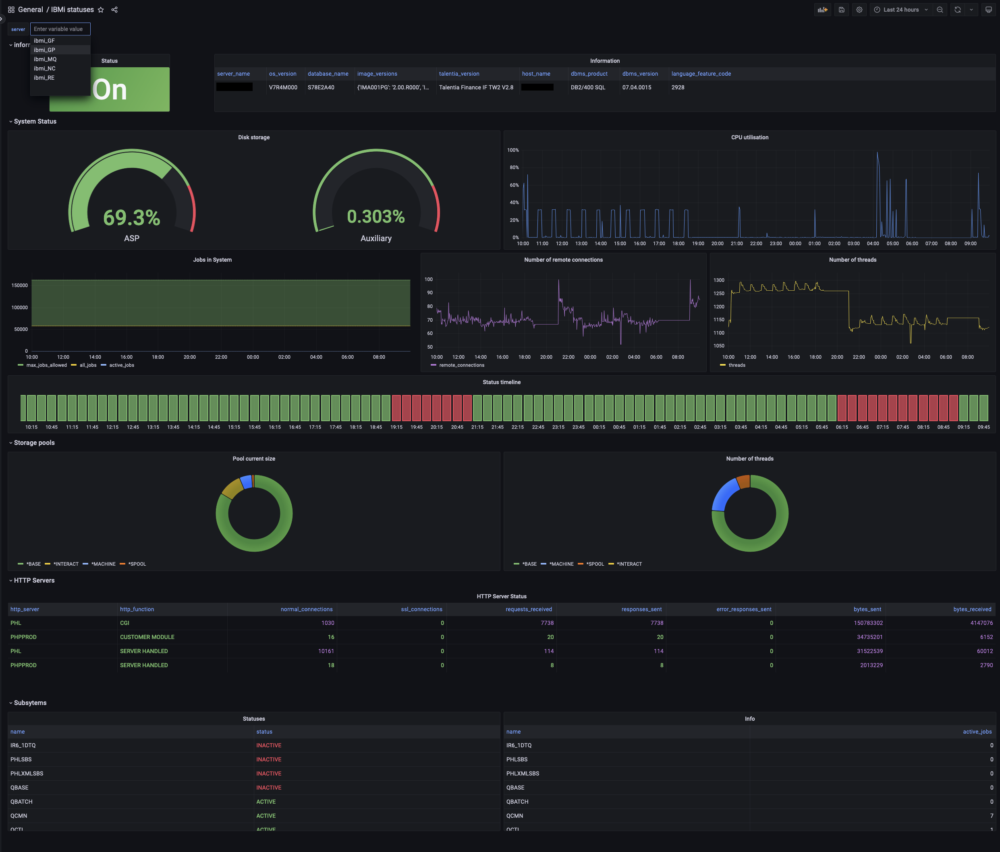

# How to monitor legacy IBM i / AS400 servers using a modern stack (Prometheus + Grafana)

## Context

To monitor an IBM i, standard tools are either proprietary solutions, that are very expensive and not compatible with a Linux ecosystem,
or you use the provided internal tools that are very limited and painful to use like the `WRKSYSSTS` command.


But, in IBM i, everything is a DB entry somehow somewhere: log, cron, users and, yes, even metrics!

Using this, we can build our own monitoring service using any ODBC-compatible technology.

## Goal
My constraints were the following:
- Prometheus format endpoint
- Get specific and explicit data, using units as recommended by [Prometheus conventions](https://prometheus.io/docs/practices/naming/#base-units) (bytes, 0-1 ratio, ...)
- Data names follow the [Prometheus conventions](https://prometheus.io/docs/practices/naming/#metric-names)
- Ability to add custom metrics (like specific software version)
- Support multiple IBM i operating system version but still takes advantage of newest features
- Remote execution (nothing installed on the monitored IBM i server)

## Solution

We will use python, pyodbc and prometheus-client to run a small metrics server.

### Metrics definition

We start by defining all the metrics that we want to collect:
```python
        self.system_status_up = self.register_metric(
            Gauge,
            "system_status_up",
            "System is up",
            labelnames=("server",),
        )
        self.info_metric = self.register_metric(
            Info,
            "ecosystem_environment",
            "Environment of the server",
            labelnames=("server",),
        )
        self.subsystem_status = self.register_metric(
            Enum,
            "subsystem_status",
            "The status of the subsystem",
            labelnames=("server", "subsystem"),
            states=["ACTIVE", "ENDING", "INACTIVE", "RESTRICTED", "STARTING"],
        )
        self.system_storage_used_ratio = self.register_metric(
            Gauge,
            "system_storage_used_ratio",
            "The percentage of the storage currently in use",
            labelnames=("server", "storage_type"),
        )
```

### SQL Queries

Then we get the results to populate our metrics from SQL queries on the appropriate table/view/function,
taking care to handle differences in DB structure between different OS/400 versions.
```python
        with connection.cursor() as cursor:
            try:
                cursor.execute(
                    "SELECT * FROM TABLE(QSYS2.SYSTEM_STATUS(RESET_STATISTICS=>'YES',DETAILED_INFO=>'ALL')) X"
                )
            except pyodbc.Error as e:
                # before V7R3 there is no DETAILED_INFO parameter
                cursor.execute(
                    "SELECT * FROM TABLE(QSYS2.SYSTEM_STATUS(RESET_STATISTICS=>'YES')) X"
                )
            row = dict(
                zip((column[0] for column in cursor.description), cursor.fetchone())
            )
```

### Data update

We update the appropriate metric, we can also apply a transformation if needs be.
```python
        value = row.get("SYSTEM_ASP_USED", None)
        if value is not None:
            self.system_storage_used_ratio.labels(
                **{"server": db_name, "storage_type": "asp"}
            ).set(value / 100)  # convert from 0-100 ratio to 0-1
```
### Handle server downtime
Gracefully handle remote server downtime by... updating a metric about it.

```python
        try:
            with IBMiConnection.managed_connection(
                db_settings,
                readonly=True,
            ) as connection:
                self.fill_metrics(connection, db_name)
                self.system_status_up.labels(server=db_name).set(1)
        except pyodbc.OperationalError as e:
            self.system_status_up.labels(server=db_name).set(0)
```

### Loop and enjoy
prometheus-client will handle the complexity of serving your HTTP endpoint using the last up-to-date data.
You simply need to loop indefinitely on the metrics update methods.

```python
if __name__ == "__main__":
    start_http_server(settings.PROMETHEUS_CLIENT_PORT)
    _metrics=IbmiMetrics()
    while True:
        _metrics.refresh()
```

The complete code can be found in the [src folder](src).

## Result
Using the provided code, you can generate the following Grafana dashboard:



I have 5 servers in different countries and I now have an easy, centralised way to see what state they are in anytime of the day!

I collected additional info about two important softwares that run on my servers (see TODO in [metrics.py](src/metrics.py)),
everything else is provided by the code as-is.

The exported Grafana dashboard is also provided for reuse: [dashboard-grafana.json](resources/dashboard-grafana.json)

## Alternatives

- https://github.com/IBM/ibmi-oss-examples/tree/master/nodejs/grafana-backend
  - NodeJS metrics server + Grafana config
  - Made to run inside the IBM i server
  - Is the format Prometheus-compatible?
- https://github.com/ThePrez/prometheus-exporter-jdbc
  - Prometheus exporter
  - Remote monitoring allowed
  - Expose raw SQL data, configuration is done via SQL request choice only


## How to run

Add the following rule to your local DNS configuration (for mac, it should be added to `/etc/hosts`):
```
127.0.0.1	local-app.domain.ovh
```


Go to [IBM i driver download page](https://www.ibm.com/resources/mrs/assets/DownloadList) (you'll need an IBM account to access it),
download the "ACS Linux App Pkg" containing "IBMiAccess_v1r1_LinuxAP.zip".
Unzip the folder inside `buildrun/docker/main-app/drivers`.
In the project [Dockerfile](buildrun/docker/main-app/Dockerfile), replace `DRIVER_VERSION` everywhere with the version that you downloaded.

Finally, execute:
```shell
# Update secrets.env with real credentials of your server, follow the provided format
cp buildrun/docker/main-app/secrets_sample.env buildrun/docker/main-app/secrets.env
cd buildrun/docker/docker-compose/dev-env
docker compose up -d
```
App is accessible at https://local-app.domain.ovh

### Additional info
Ports [80, 443, 8383] must be available on your machine (reserved by the [Caddy](https://caddyserver.com/) service).

Run `docker compose up compile-dep` to upgrade dependencies.

## How to contribute

PR welcome

### Prerequisites
#### precommit
- [Install pre-commit](https://pre-commit.com/#installation)
- Run `pre-commit install` in the project root
